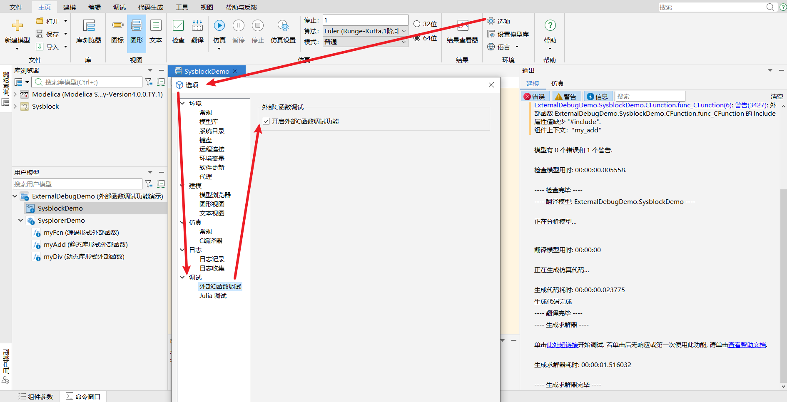
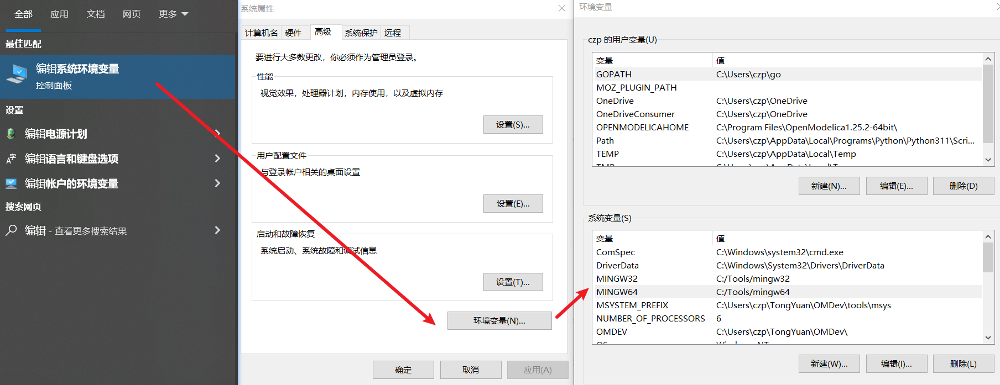
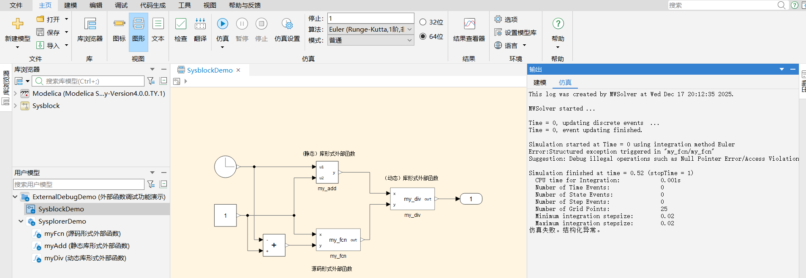
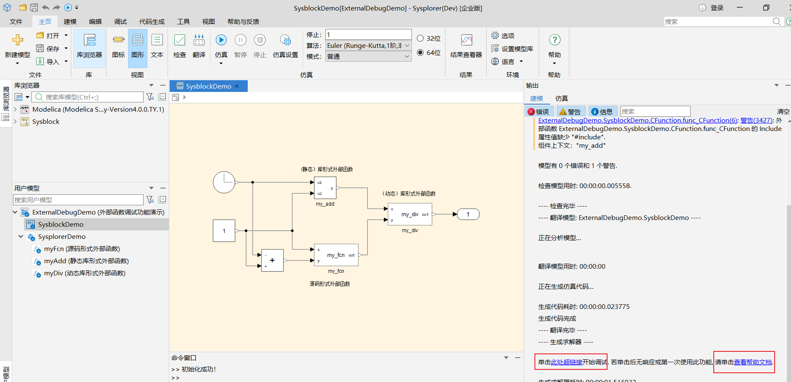
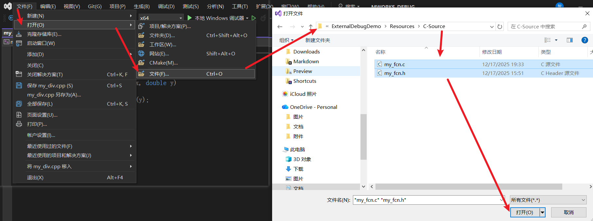
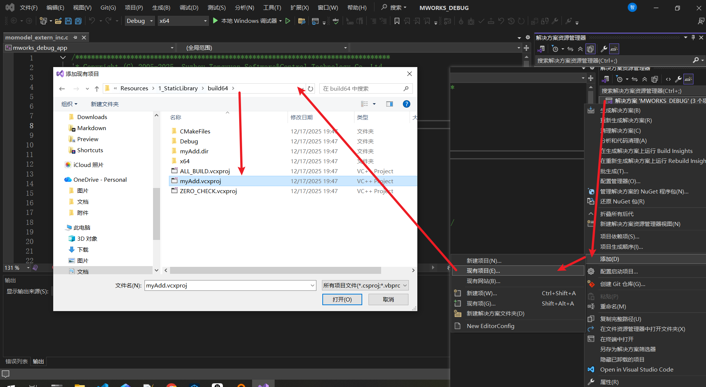
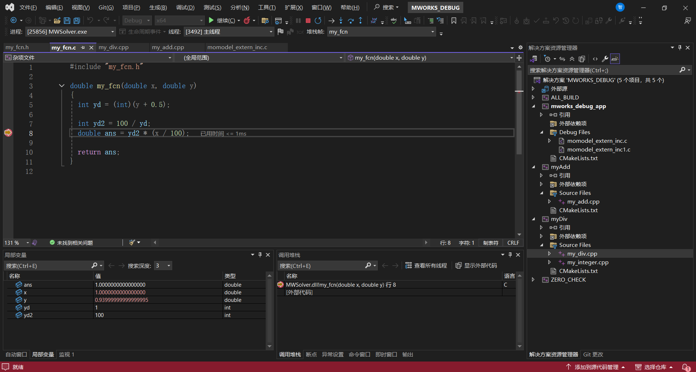
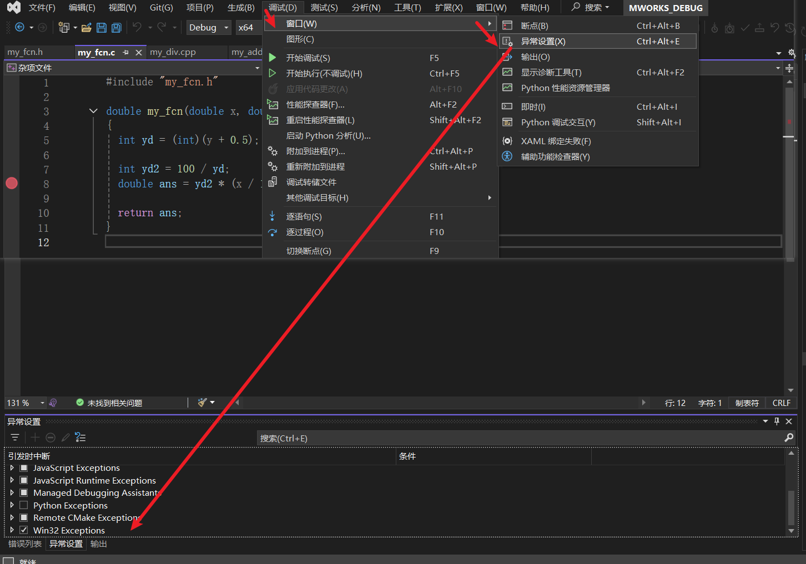
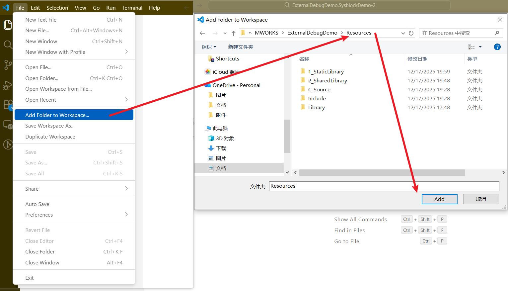
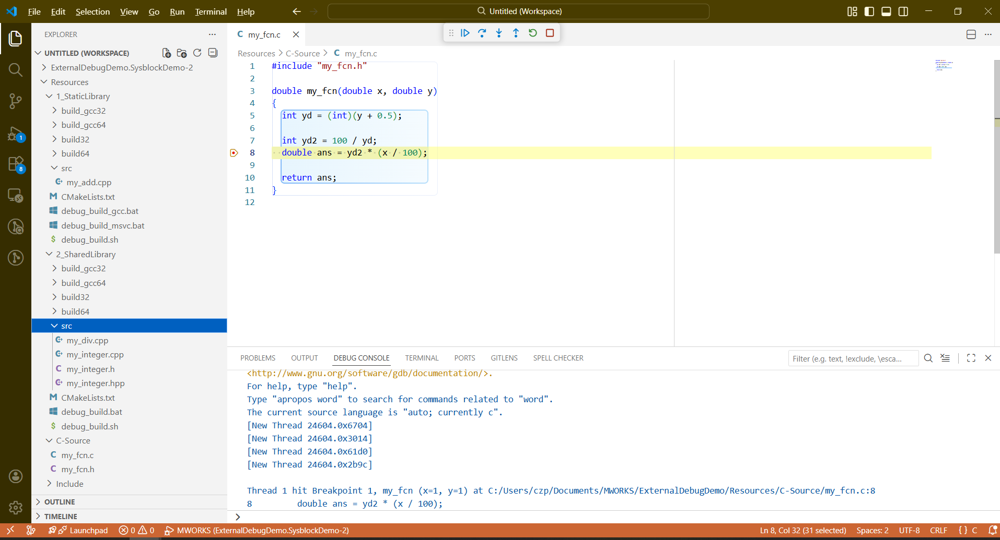

# 外部函数调试功能演示

> 本文档基于 MWORKS.Sysplorer 2025b 1130 及其之后版本

当前 Sysplorer 支持

1. Windows VS 调试
2. Windows VSCode 调试
3. Linux VSCode 调试

Sysplorer 外部函数官方调试文档：[Windows 版本](https://docs-dev.tongyuan.cc/sysplorerdocs/Help/DevelopingModels/index.html#/Doc/DevelopingModels/AdvancedModels/ModelDebug/WindowsExternalFcnDebug.html )，[Linux 版本](https://docs-dev.tongyuan.cc/sysplorerdocs/Help/DevelopingModels/index.html#/Doc/DevelopingModels/AdvancedModels/ModelDebug/LinuxExternalFcnDebug.html)

## 开启选项

**外部函数调试功能**开启方法：主页-选项-调试-外部C函数调试-勾选开启外部C函数调试功能，如下图：



## 生成库文件

示例中存在静态库、静态库，另外代码可以是 C++ 代码，但头文件必须是**C 接口**， 可参考：[my_div.h](ExternalDebugDemo/Resources/Include/my_div.h)。另外示例中源码形式外部函数必须是 C 代码，可参考 [my_fcn.c](ExternalDebugDemo/Resources/C-Source/my_fcn.c)。

### Windows VS 调试

首先需自行安装 Visual Studio，并进入 `ExternalDebugDemo/Resources` 目录，双击运行 `debug_build_msvc.bat` 生成动态库

### Windows VSCode 调试

请设置 MINGW64 和 MINGW32 的环境变量（路径请使用 `/` 不要使用 `\`）



也可以使用 Sysplorer 内置 gcc 的路径

``` bat
set MINGW32=Sysplorer安装路径/Simulator/mingw32
set MINGW64=Sysplorer安装路径/Simulator/mingw64
```

并进入 `ExternalDebugDemo/Resources` 目录，双击运行 `debug_build_gcc.bat` 生成动态库

### Linux VSCode 调试

进入 `ExternalDebugDemo/Resources` 目录，打开命令行，输入下面命令生成动态库

``` shell
bash debug_build.sh
```

### 调试准备工作

请先开启**外部函数调试功能**，加载模型：拖拽 ExternalDebugDemo 目录下的 `package.mo` 到 Sysplorer 界面即可，点击仿真。



切回到下面界面：



如果是第一次使用此功能，请务必**点击查看帮助文档**，安装必要的软件等准备工作，点击超链接即可自动跳转到调试界面

### 调试界面

### Windows VS 调试

若在 Sysplorer 中选择 VC 编译器，则点击超链接会弹出 VS 界面。

对于源码形式的外部函数，可以直接通过打开文件的方式加入到 VS 工程中


对于库形式的外部函数，可以通过添加项目的方式加入到 VS 工程中


重复上述动作，可将所有需要调试的代码加入到 VS 工程中，添加断点后，点击“本地 Windows 调试器”（快捷键 F5）即可开始调试，效果如图：



**额外说明**：对于仿真崩溃、结构化异常场景，请务必在 调试-窗口-异常设置中勾选 Win32 Exceptions，如下图：



### Windows VSCode 调试

若在 Sysplorer 中选择 gcc 编译器，则点击超链接会弹出 VSCode 界面。

将外部函数所在文件夹加入到工作区：



设置断点，点击 F5，



### Linux VSCode 调试

Linux 平台 Sysplorer 目前仅支持 gcc 编译器，帮助文档已介绍其使用，VSCode 内部操作与 Windows 一致，不再赘述。

## 声明

将在 https://github.com/Modelica-ZhipengChen/ExternalDebugDemo 持续更新。
